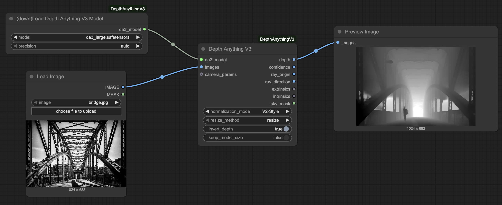
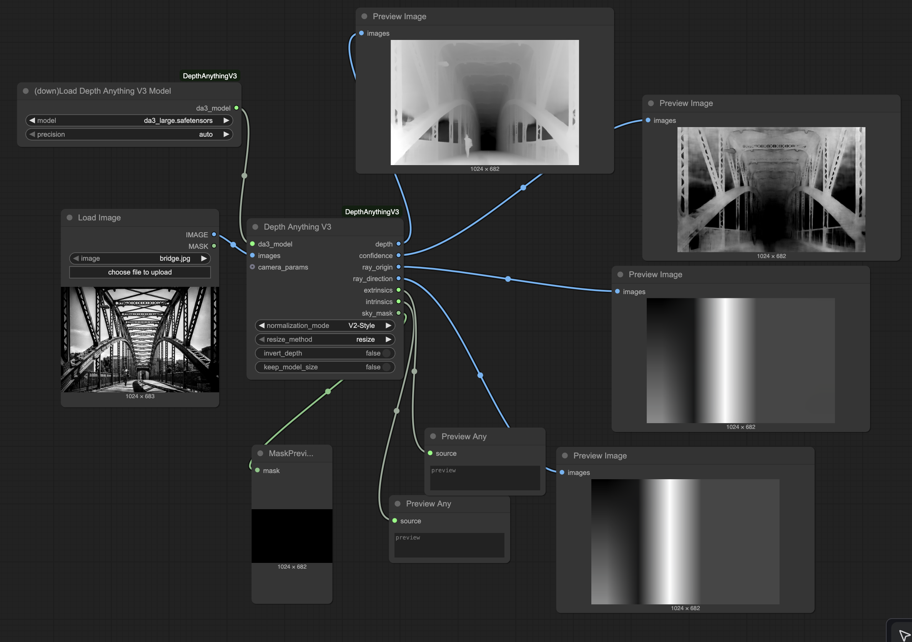

# ComfyUI Depth Anything V3

Custom nodes for [Depth Anything V3](https://github.com/ByteDance-Seed/Depth-Anything-3) integration with ComfyUI.

## Demo Videos

You can use the multi-view node to use the cross attention feature of the main class of models. This is done to have a more consistent depth across frames of a video.

You can reconstruct 3D point clouds!

Even from multiple views, with the option to either match them (with icp) or leave them to use the predicted camera positions.

## Description

Depth Anything V3 is the latest depth estimation model that predicts spatially consistent geometry from visual inputs.

**Published**: November 14, 2025
**Paper**: [Depth Anything 3: Recovering the Visual Space from Any Views](https://arxiv.org/abs/2511.10647)

## Nodes

### Model Loading
**Download And Load Depth Anything V3 Model** - Downloads and loads model from HuggingFace
- Inputs: `model` (variant), `precision` (auto/fp16/fp32/bf16)
- Output: `da3_model`
- Models auto-download to `ComfyUI/models/depthanything3/`

**DA3 Enable Tiled Processing** - Configure model for high-resolution images
- Inputs: `da3_model`, `tile_size`, `overlap`
- Output: `da3_model` (with tiled config)
- Use for 4K+ images to avoid OOM errors

### Inference Nodes

**Depth Anything V3** - Unified depth estimation with multiple normalization modes
- Inputs: `da3_model`, `images`, `normalization_mode`, `camera_params` (optional), `resize_method`, `invert_depth`, `keep_model_size`
- Outputs: `depth`, `confidence`, `ray_origin`, `ray_direction`, `extrinsics`, `intrinsics`, `sky_mask`
- **Normalization Modes:**
  - **Standard**: Original V3 min-max normalization (0-1 range, includes sky in normalization)
  - **V2-Style** (default): Disparity-based with content-aware contrast - best for ControlNet workflows
    - Sky appears BLACK (like Depth Anything V2)
    - Content-only normalization excludes sky from range calculation
    - Percentile-based contrast enhancement (1st-99th percentile)
    - Enhanced depth gradations via contrast boost
    - Subtle edge anti-aliasing for natural transitions
    - Contribution by [Ltamann (TBG)](https://www.patreon.com/posts/tbg-takeaways-v3-143804015)
  - **Raw**: No normalization, outputs metric depth values for 3D reconstruction/point clouds

**Note:** The unified node always outputs all available data. Connect only the outputs you need - unused outputs are simply ignored.

**Depth Anything V3 (Multi-View)** - Process multiple images with cross-view attention
- Inputs: `da3_model`, `images` (batch), `normalization_mode`, `resize_method`, `invert_depth`
- Outputs: `depth`, `confidence`, `ray_origin`, `ray_direction`, `extrinsics`, `intrinsics`, `sky_mask`
- **Normalization modes**: Standard, V2-Style (default), Raw
- Use for video frames or multiple angles of same scene
- Normalizes depth across all views together for temporal/spatial consistency

### 3D Processing

**DA3 to Point Cloud** - Convert depth to point cloud using geometric unprojection
- Inputs: `depth_raw`, `confidence`, `sky_mask` (optional but recommended), `intrinsics` (optional), `source_image` (optional)
- Output: `pointcloud`
- **Sky filtering**: When sky_mask is connected, sky pixels are automatically excluded from the point cloud
- **Input validation**: Automatically detects and rejects normalized depth inputs (requires Raw mode)

**DA3 to Point Cloud (Multi view)** - Convert depth to point cloud using geometric unprojection

**DA3 Save Point Cloud** - Export to PLY format

**DA3 to 3D Gaussians** - Extract 3D Gaussian splats (placeholder)

**DA3 Save 3D Gaussians** - Export Gaussians to PLY

### Camera Utilities
**DA3 Create Camera Parameters** - Create camera conditioning input

**DA3 Parse Camera Pose** - Parse camera parameters from JSON

## Model Variants

| Model | Size | Features |
|-------|------|----------|
| DA3-Small | 80M | Fast, good quality |
| DA3-Base | 220M | Balanced quality and speed |
| DA3-Large | 350M | High quality, balanced |
| DA3-Giant | 1.15B | Best quality, slower |
| DA3Mono-Large | 350M | Optimized for monocular depth |
| DA3Metric-Large | 350M | Metric depth estimation |
| DA3Nested-Giant-Large | 1.4B | Combined model with metric scaling |

## Model Capabilities

Different models support different features:

| Feature | Small/Base/Large/Giant | Mono-Large | Metric-Large | Nested |
|---------|------------------------|------------|--------------|--------|
| **Sky Segmentation** | ❌ | ✅ | ✅ | ✅ |
| **Camera Conditioning** | ✅ | ❌ | ❌ | ✅ |
| **Multi-View Attention** | ✅ | ⚠️ | ⚠️ | ✅ |
| **3D Gaussians** | ✅* | ❌ | ❌ | ✅* |
| **Ray Maps** | ✅ | ❌ | ❌ | ✅ |

- ✅ = Fully supported
- ❌ = Not available (returns zeros/ignored)
- ⚠️ = Works but no cross-view attention benefit (images processed independently)
- ✅* = Requires fine-tuned model weights (placeholder in current release)

**Choose your model based on needs:**
- Need sky masks? → Use Mono/Metric/Nested (required for V2-Style normalization)
- Need camera conditioning? → Use Main series or Nested
- Processing video/multi-view? → Use Main series or Nested for consistency
- Single images only? → Any model works

## Workflow Tips

### For ControlNet Depth Workflows
1. Use **Mono** or **Metric** models (they provide sky segmentation)
2. Set **normalization_mode** to **V2-Style** (default)
3. Connect the `depth` output to your ControlNet node
4. Enjoy clean depth maps with proper sky handling!

### For 3D Reconstruction (Point Clouds)
1. Use any model (Mono/Metric recommended for sky filtering)
2. Set **normalization_mode** to **Raw**
3. Connect `depth` → `depth_raw`, `confidence` → `confidence`, `sky_mask` → `sky_mask` to **DA3 to Point Cloud**
4. Sky pixels will be automatically excluded if sky_mask is connected
5. **Important**: Point cloud nodes validate input and will raise an error if normalized depth is detected (prevents incorrect 3D output)

## Credits

- **Original Paper**: Haotong Lin, Sili Chen, Jun Hao Liew, et al. (ByteDance Seed Team)
- **Original Implementation**: [PozzettiAndrea](https://github.com/PozzettiAndrea)
- **V2-Style Normalization**: [Ltamann (TBG)](https://github.com/Ltamann) - See [TBG Takeaways: Depth Anything V3](https://www.patreon.com/posts/tbg-takeaways-v3-143804015) for workflow examples
- **Based on**: Official [Depth Anything 3 repository](https://github.com/ByteDance-Seed/Depth-Anything-3)
- **Inspiration**: [kijai's ComfyUI-Depth-Anything-V2](https://github.com/kijai/ComfyUI-DepthAnythingV2)

## License

Model architecture files based on Depth Anything 3 (Apache 2.0 / CC BY-NC 4.0 depending on model).

Note: Some models (Giant, Nested) use CC BY-NC 4.0 license (non-commercial use only).